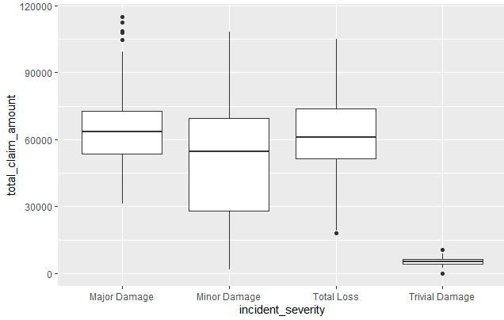

# Insurance Claims Risk Analysis & Actuarial Pricing Model

## Project Objective
To analyze insurance claims data and develop a risk-based pricing framework using actuarial and data analytics techniques. The project focuses on claim frequency, claim severity, risk segmentation, and premium estimation using Excel, R, and Power BI.

## Tools Used
- Excel
- R
- Power BI

## Dataset

Source: Insurance Fraud Detection Dataset (Kaggle)

Dataset Size:

* 1,000 insurance claim records
* 39 variables

Key Variables:

* Age
* Policy Annual Premium
* Policy Deductible
* Incident Severity
* Total Claim Amount
* Injury Claim
* Property Claim
* Vehicle Claim
* Fraud Reported

The dataset contains policyholder, vehicle, incident, and claims information that will be used to evaluate claim severity, fraud patterns, and insurance risk drivers.


## Current Status

Project Progress: 30% Complete

- [x] Repository Setup
- [x] Dataset Collection
- [x] Data Understanding
- [x] Exploratory Data Analysis
- [ ] Claim Frequency Analysis
- [ ] Claim Severity Analysis
- [ ] Risk-Based Pricing Framework
- [ ] Power BI Dashboard
- [ ] Final Report

## Repository Structure

```text
insurance-claims-risk-analysis/
│
├── data/
├── scripts/
├── dashboard/
├── reports/
├── images/
└── README.md
```

## Project Goal
The objective is to identify key risk drivers affecting insurance claims and develop actuarially justified pricing recommendations using historical claims data.


## Expected Outcomes

- Identify high-risk policyholder segments.
- Analyze claim frequency and severity patterns.
- Develop a risk-based pricing framework.
- Create interactive dashboards for portfolio monitoring.
- Generate underwriting and pricing recommendations.


## Key Findings So Far

### Age Group Analysis
Average claim amounts were highest among policyholders aged 55+, indicating potential differences in claim severity across age groups.

### Incident Severity Analysis
Major Damage and Total Loss incidents generated the highest average claim amounts, exceeding 62,000 on average.

### Fraud Analysis
Fraudulent claims exhibited average claim costs approximately 20% higher than non-fraudulent claims.

### Claim Component Analysis
Vehicle claims represented the largest component of total losses, averaging approximately 37,929 per claim.

## Sample Visualization

### Claim Amount by Incident Severity


