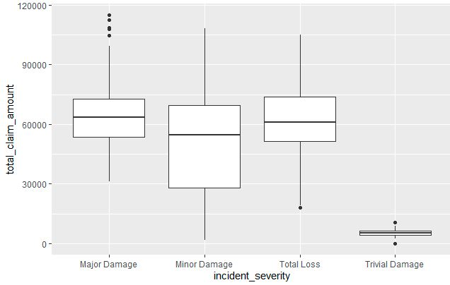

# Insurance Claims Risk Analysis & Actuarial Pricing Framework


## Project Objective
To analyze insurance claims data using actuarial and data analytics techniques to identify key risk drivers, evaluate claim severity and fraud patterns, develop a rule-based risk segmentation framework, and propose data-driven pricing recommendations.

## Tools & Technologies

- **R** – Data cleaning, exploratory analysis and risk segmentation
- **Excel** – Data validation and preprocessing
- **Power BI** – Interactive dashboard development (in progress)
- **Git & GitHub** – Version control and project documentation


## Methodology

1. Data Collection
2. Data Cleaning
3. Exploratory Data Analysis
4. Claim Severity Analysis
5. Fraud Analysis
6. Risk Segmentation
7. Risk-Based Pricing Framework
8. Dashboard Development


## Dataset

Source: Insurance Fraud Detection Dataset (Kaggle)

Dataset Size:

* 1,000 insurance claim records
* 39 variables

Key Variables:

* Age
* Policy Annual Premium
* Policy Deductible
* Incident Severity
* Total Claim Amount
* Injury Claim
* Property Claim
* Vehicle Claim
* Fraud Reported

The dataset contains policyholder, vehicle, incident, and claims information that will be used to evaluate claim severity, fraud patterns, and insurance risk drivers.


## Current Status

Project Progress: 45% Complete

- [x] Repository Setup
- [x] Dataset Collection
- [x] Data Understanding
- [x] Exploratory Data Analysis
- [ ] Claim Frequency Analysis
- [ ] Claim Severity Analysis
- [ ] Risk-Based Pricing Framework
- [ ] Power BI Dashboard
- [ ] Final Report

## Repository Structure

```text
insurance-claims-risk-analysis/
│
├── data/
├── scripts/
├── dashboard/
├── reports/
├── images/
└── README.md
```

## Project Goal
The objective is to identify key risk drivers affecting insurance claims and develop actuarially justified pricing recommendations using historical claims data.


## Expected Outcomes

- Identify high-risk policyholder segments.
- Analyze claim frequency and severity patterns.
- Develop a risk-based pricing framework.
- Create interactive dashboards for portfolio monitoring.
- Generate underwriting and pricing recommendations.


## Key Findings

- Analyzed 1,000 insurance claims across 39 variables using R.
- Identified incident severity as the strongest driver of claim amounts.
- Found that fraudulent claims exhibited higher average claim costs than non-fraudulent claims.
- Determined that vehicle claims accounted for the largest share of total claim costs.
- Developed and validated a rule-based risk segmentation model that
 classified policyholders into Low, Medium, and High Risk groups based on claim characteristics.


## Future Enhancements

- Predictive claim severity modelling
- Generalized Linear Models (GLMs)
- Automated pricing recommendations
- Interactive Power BI dashboard


## Sample Visualization

### Claim Amount by Incident Severity


